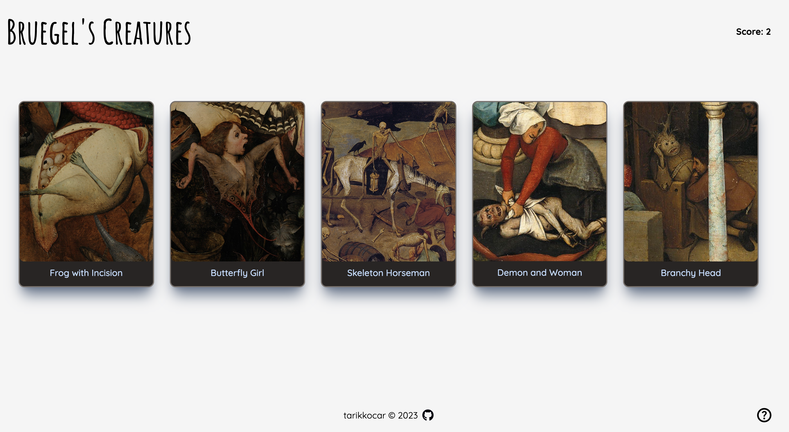

# Bruegel's Creatures: A Memory Card Game

## [Live Demo](https://memory-game-nine-plum.vercel.app/)

Pieter Bruegel the Elder was a 16th-century Flemish Renaissance painter known for his detailed and panoramic landscapes and depictions of everyday life.

In addition to his remarkable ability to capture the human experience, Bruegel's paintings often featured imaginative and fantastic creatures, adding an element of whimsy and intrigue to his work.

This is a simple memory game featuring some of Pieter Bruegel's odd creatures. The objective is to select 12 creatures without repeating to win the game. It's a part of The Odin Project curriculum.

## Built with:

- React
- Tailwind CSS
- Framer Motion
